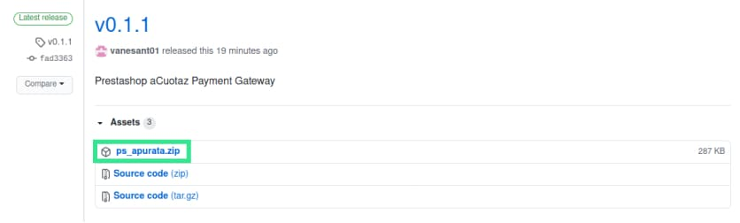
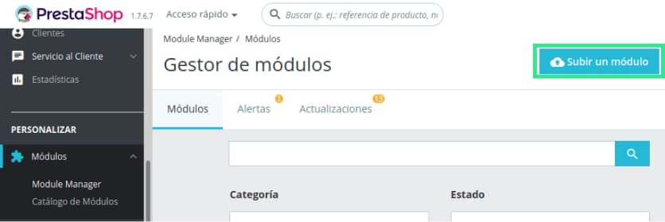
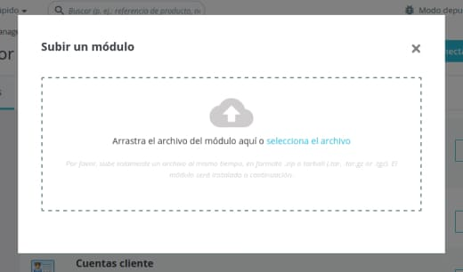
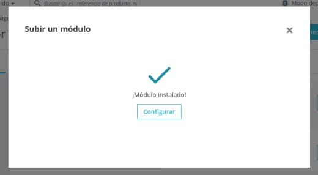
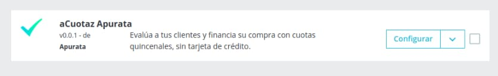
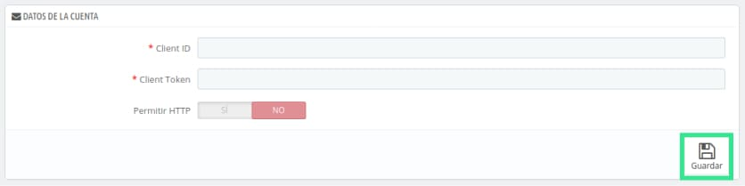
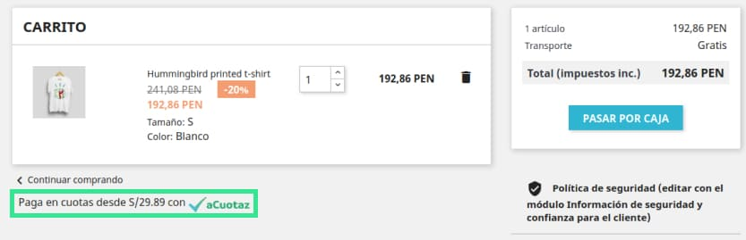
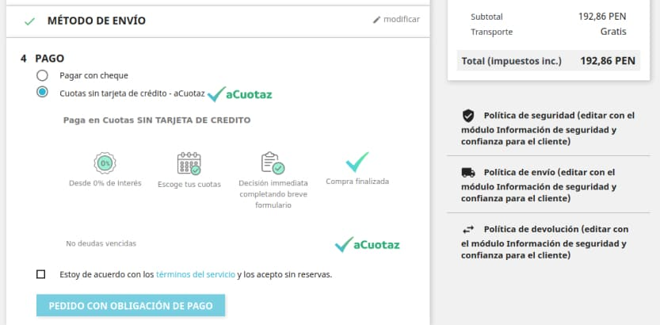
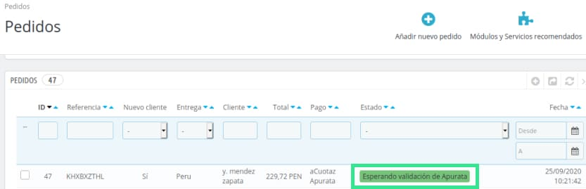
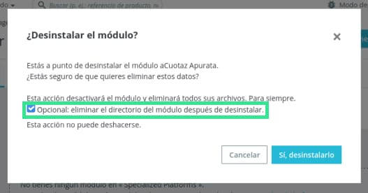

# aCuotaz module for Prestashop
_Evaluate your customers and finance their purchase with fortnightly instalments, without a credit card._

## Starting 🚀
_These instructions will allow you to upload the [aCuotaz](https://apurata.com/app) module into your Prestashop store._

### Requirements 📋
* Prestashop version: 1.7.1.0 - 1.7.6.7 (latest version)
* Minimum version of PHP: 7.2

### Installation 🛠️

_Request your aCuotaz credentials with us, if you already have them continue the steps._

1. Download the latest version of the file "ps_apurata.zip" from the following link: [Releases](https://github.com/apurata/prestashop-acuotaz-payment-gateway/releases)

2. Now go to your store's Module Manager and click on "Upload a Module".

3. Upload the file "ps_apurata.zip"

4. Once uploaded, a confirmation message "Module installed" should appear. If an error occurs, please confirm the requirements for installing this module or contact us.

5. That's it, now you just need to configure the module. You can click on "Configure" from the previous window or you can reload the page and you will see it together with your other modules.

6. In the configuration you must enter your Client ID and Client Token with the credentials generated by aCuotaz. If your page is not HTTPS you can allow HTTP by clicking "YES", otherwise you can leave it as "NO". Click on "Save" and you're done.

### It is already working 📦
_These are the changes you will see in your prestashop._

* Now in the shopping cart it shows you the option to pay with aCuotaz

* Now you can see aCuotaz as a payment method

* When your customers agree to pay with aCuotaz and it is approved by us, the order will be created with the following status "Waiting for Apurata validation".

### Update version 📌

_To update the module with a new version._ 
* First you must uninstall the current module and check "Optional: remove module directory after uninstallation" and upload the new version again.

### More about aCuotaz
* [Benefits](https://apurata.com/app)
* [how does it work?](https://apurata.com/app/para-clientes)
* [who already uses it?](https://apurata.com/app/consumidores)
* [Integrations with more platforms](https://apurata.com/app/integraciones)

Thank you for reading, with ❤️ for [aCuotaz](https://apurata.com/app) 😊
